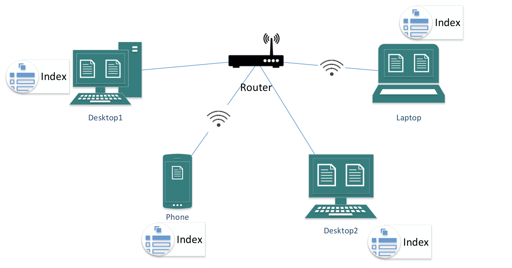

 Distributed Indexing for Information Retrieval on a Multi-Device Network

December 2017

## Abstract
The goal of the project is to respond to a query made by a device on a multi-device network where each device implements its own IR model for cleaning and indexing. Each device can use a different similarity measure. Our system ensures compatibility across the IR models in order to seamlessly and efficiently fetch the relevant documents.

---
## Solution Approach
- Each device builds and stores its own index
- Each device also hosts a file server and a query server
- The file server provides APIs to make queries on the files on the device, using the IR model
hosted by the device
- The query server acts as an interface to the end-user making queries, and also performs
score normalization and result merging
- When the end-user makes a query through any thin client on the network (such as a
browser), the query server broadcasts it to the file servers on the network
- Each device performs a lookup on its respective index and returns the relevant document
IDs and the similarity scores (in the device space) to the query server
Desktop2
- The similarity scores from the individual result lists are normalized, and result merging is achieved by evaluating each of the models and using their relevance scores to merge the individual result lists into a unified list of relevant document IDs across the network
- This final list of documents and the contents of each of the documents are then displayed on the user’s screen

## Score Normalization and Result Merging
- Each of the retrieved document lists from individual file servers are first normalized using the MinMax score normalization technique:
~~~
S’=(S-Smin)/(Smax –Smin)
~~~
- This technique normalizes the similarity scores in each list such that the normalized scores lie between 0 and 1
- A weighting function is used to factor in the evaluation score of the IR model used to retrieve the documents from each of the devices. This step is performed in order to take into consideration the difference in effectiveness of the different IR models employed by the devices on the network
- The individual lists, after normalization and weighting, are merged into a single list and sorted on the new scores to obtain the final document list, which is then returned to the user

---
## Implementation Details
* Infrastructure:
  * 3 laptops connected to the same network
  * Each laptop contains different corpora of text documents
  * Each laptop uses a different IR model for indexing and querying
  * Each laptop runs two web services: file server and query server
  * A mobile device connected to the same network, running a browser app
* Code
  * IR models used:
      * Vector Space Model (tf-idf)
      * Probabilistic Model (BM25)
      * Language Model (N-grams)

* Model Evaluation:
  * Dataset: TIME, LISA
  * Performed on an Ubuntu virtual server on the cloud with the following specs: 12 GB RAM and 6 CPU Cores
  * Query output labels (document list) are compared with Test query labels to determine Precision and Recall, and hence, Fβ scores for each of the models

* Data sanitization:
  * Lemmatization – WordNetLemmatizer (library used)
  * Stopword removal – Domain-specific stopwords

* Index creation and storage – pickling

* File server:
  * /retrieve : accepts queries, returns document list along with similarity scores
  * /getdocument: accepts document name, returns contents of the document
  * /getmodel: returns the name of the IR model being used by the device

* Query server:
  * /query: accepts query from end-user, broadcasts it to all file servers on the network, gets individual document lists, performs score normalization and result merging and returns final document list to end-user
  * GUI: allows user to make queries and view results on browser

---
## Issues
Non-availability of appropriate datasets with labelled test queries for model evaluation. Hence could not obtain the P-R and RoC curves and F1 evaluation scores for the various IR models.

---
## References

* Models:
  * ngram:
     * https://en.wikipedia.org/wiki/Language_model#n-gram_models
  * bm25:
     * https://en.wikipedia.org/wiki/Okapi_BM25
     * http://opensourceconnections.com/blog/2015/10/16/bm25-the-next-generation-of-lucene-relevation/
     * For code:
          * https://github.com/RaRe-Technologies/gensim/blob/develop/gensim/summarization/bm25.py
          * https://github.com/AlessandraSozzi/Lucene-python/blob/master/LuceneScoringFunctions.ipynb
          * https://github.com/nhirakawa/BM25/blob/master/text/queries.txt
* Others:
  * http://mccormickml.com/2016/04/19/word2vec-tutorial-the-skip-gram-model
  * https://www.quora.com/Is-doc2vec-suitable-in-information-retrieval-to-calculate-distance-between-query-and-doc
  * https://www.quora.com/What-are-the-alternative-to-vector-space-model
	
* Score Normalizations:
  * http://www.wseas.org/multimedia/journals/information/2015/a265809-651.pdf Datasets:
  * http://ir.dcs.gla.ac.uk/resources/test_collections/lisa
  * https://www.quora.com/What-are-good-sources-to-find-labeled-dataset-for-document-topic-classification-projects
